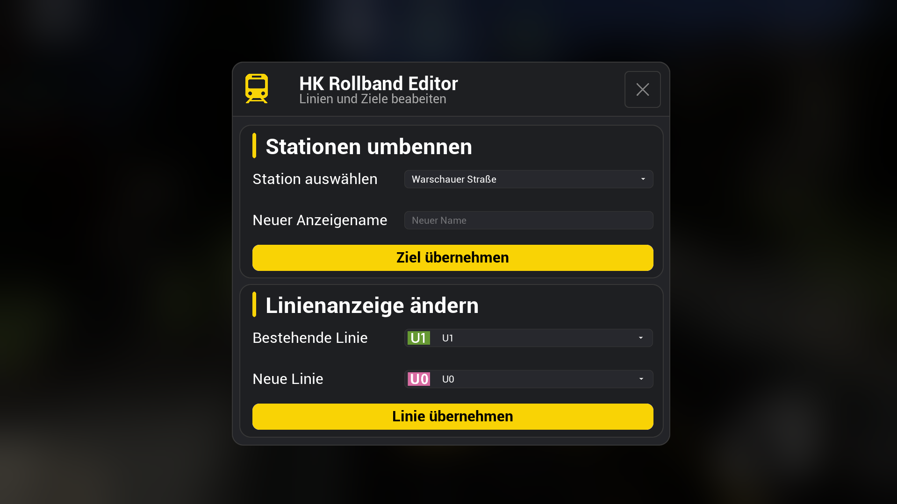
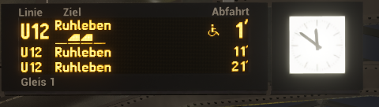
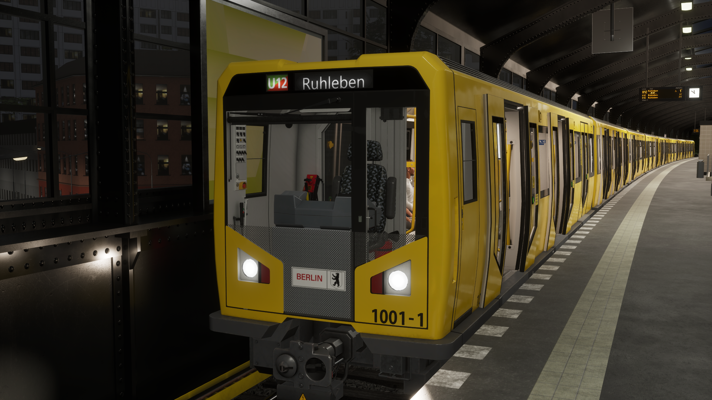

# 🚇 HK Rollband Editor

Mit dem **HK Rollband Editor** lassen sich die Linien- und Zielanzeigen des HK in **SubwaySim 2** direkt während des Spiels verändern.

Der Editor aktualisiert nicht nur die äußere Zugzielanzeige, sondern übernimmt die ausgewählte Linie und das Ziel auch auf weitere Fahrgastanzeigen.

> [!IMPORTANT]
> Dieses Projekt ist eine inoffizielle Modifikation und steht in keiner Verbindung zu Simuverse Interactive, Aerosoft oder den Berliner Verkehrsbetrieben (BVG).

---

## ✨ Funktionen

- Stations- und Zielnamen frei ändern
- Bestehende Linien durch andere Linien ersetzen
- Zusätzliche fiktive Linien auswählen
- Darstellung der echten Linienfarben
- Linienlogos direkt in der Benutzeroberfläche
- Aktualisierung der äußeren Zugzielanzeige
- Aktualisierung der Fahrgastinformationsanzeigen im Zug
- Aktualisierung kompatibler DAISY-Anzeigen
- Moderne Benutzeroberfläche
- Änderungen werden direkt während des Spiels übernommen

---

## 🚇 Unterstützte Linien

### Reguläre Linien

- U1
- U2
- U3
- U4
- U5
- U6
- U7
- U8
- U9

### Zusätzliche Linien

- U0
- U10
- U11
- U12
- U13
- U15
- U23
- U35
- U55

Die zusätzlichen Linien sind teilweise ehemalige, geplante oder fiktive Linien und gehören nicht zum aktuellen regulären Berliner U-Bahn-Netz.

---

## 📸 Screenshots

  
  
  

